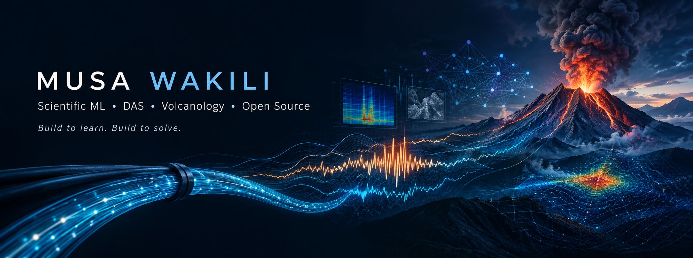

<!--  -->

<p align="center">
  
</p>

<div align="center"><strong>Research Engineer · PhD Researcher · Open-Source Builder</strong></div>

<p align="center">
  <em>Scientific ML · Distributed Acoustic Sensing · Volcanology · Open Source</em>
</p>

<p align="center">
  <strong>Build to learn. Build to solve.</strong>
</p>

I build **machine learning systems, scientific computing tools, and open-source software** for problems where data, computation, and the real world meet.

I'm currently pursuing a **PhD at the University of Canterbury, New Zealand**, researching **Distributed Acoustic Sensing (DAS) for volcanic monitoring and eruption forecasting**.

My broader interests sit at the intersection of:

**Scientific ML · Machine Learning · Signal Processing · Computer Vision · Backend Engineering · Research Software · Open Source**.

> **Build to learn. Build things that matter.**

---

<!-- ## 🔬 What I'm Working On

My current research focuses on using **Distributed Acoustic Sensing (DAS)** to understand seismic and volcanic processes.

I'm particularly interested in building the computational infrastructure needed to make massive DAS datasets easier to:

- ⚡ Load and process efficiently
- 🧠 Analyse with machine learning
- 📊 Visualise and explore
- 🔬 Reproduce scientifically
- 🌋 Apply to volcano and geothermal monitoring

I'm also exploring the intersection of **computer vision, signal processing, and scientific machine learning** for DAS data. -->

### 🧰 Current Projects

<!-- **DAS FastLoad**  
A high-performance data-loading layer for large DAS datasets, with a focus on efficient scientific workflows.

**OpenDAS Toolkit**  
A longer-term vision for an open-source ecosystem that makes DAS data science more accessible to researchers and ML practitioners. -->

**Awesome DAS**  
A curated knowledge base of DAS papers, datasets, software, tutorials, and research resources.

**Research Knowledge Base**  
A living collection of notes, experiments, implementations, papers, and technical concepts from my PhD journey.

---

<!-- ## 🧠 My Research Interests

```text
Scientific Machine Learning
        │
        ├── Distributed Acoustic Sensing
        │       ├── Signal Processing
        │       ├── Seismic Monitoring
        │       └── Volcano Monitoring
        │
        ├── Computer Vision
        ├── Deep Learning
        ├── Representation Learning
        ├── Time-Series Analysis
        └── Large-Scale Scientific Data
```

I'm particularly interested in problems where **machine learning meets physical systems**.

--- -->

## 🛠️ What I Like Building

I enjoy building tools rather than only running experiments.

Some areas I frequently work in:

- 🤖 Machine Learning & Deep Learning
- 🔬 Scientific Computing
- 📡 Signal & Time-Series Processing
- 👁️ Computer Vision
- 🧠 AI Systems & LLMs
- ⚙️ Backend Systems & APIs
- 🚀 Developer & Research Tooling
- 📦 Python Libraries
- 🐹 Go for performance-oriented tooling
- ☁️ Cloud & Infrastructure
- 🔄 Automation & Data Pipelines
- 🌍 Open-Source Software

---

## 💻 Technical Stack

### Languages


### Machine Learning & Scientific Python


### Backend & APIs


### Infrastructure & DevOps


### Research & Knowledge Tools


---

## 📚 Research & Learning

I maintain an open research notebook where I document:

- 📄 Paper summaries
- 🧪 Experiments
- 💡 Research ideas
- 🧑🏽‍💻 Implementations
- 📊 Dataset investigations
- 📚 Technical book notes
- 🔬 DAS concepts
- 🌋 Volcanology & geophysics
- 🧠 Machine learning concepts

The goal is simple:

> **Learn in public, build reproducibly, and leave useful artifacts behind.**

---

## 🌍 Open Source

I believe research software should be treated as **software**, not disposable code.

I'm interested in building open-source tools that make scientific datasets easier to work with and help researchers spend less time fighting infrastructure.

If you're working on:

- DAS
- scientific ML
- seismic data
- signal processing
- research software
- ML infrastructure
- open-source scientific tooling

I'd love to hear from you.

---

## ✍🏽 Writing

I write about things I'm learning, building, and investigating.

### Essentialist Programmer

**Software engineering · Python · AI · backend systems · lessons from building**.
<!-- [Read my writing →](https://medium.com/essentialist-developer) -->
[Read my writing →](https://musawakiliml.blog/)

---

## 🤝 Let's Collaborate

I'm particularly interested in collaborating on projects involving:

- 🔬 Scientific Machine Learning
- 📡 Distributed Acoustic Sensing
- 🌋 Volcanology & Geophysics
- 🤖 AI/ML systems
- 🐍 Python tooling
- 🐹 Go-based scientific software
- 📦 Open-source libraries
- ⚙️ Research infrastructure
- 🌍 Open science

If you're building something interesting, feel free to reach out.

---

## 📬 Find Me Online

[](https://github.com/musawakiliML)
[](https://www.linkedin.com/in/musa-adamu-wakili-711704154/)
[](https://YOUR_HASHNODE_USERNAME.hashnode.dev)
[](https://x.com/musawakiliML)
<!-- [](https://medium.com/essentialist-developer) -->

---

<!-- ## 📊 GitHub Activity

<p align="center">
  
  
</p>

--- -->

<!-- ### 🧭 Current Direction

```text
Machine Learning
       ↓
Scientific Machine Learning
       ↓
Distributed Acoustic Sensing
       ↓
Volcano & Seismic Monitoring
       ↓
Open-Source Research Infrastructure
``` -->

**Build to learn. Build to solve. Build in public.**
